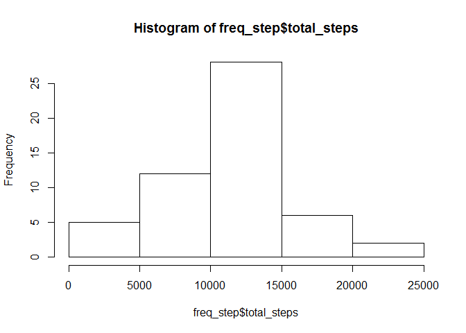
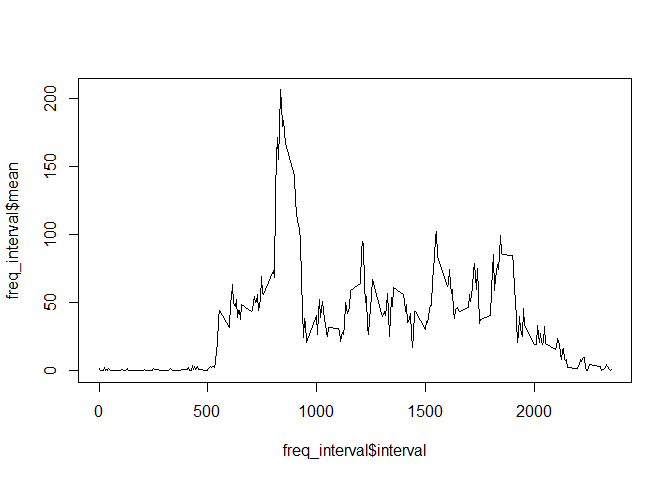
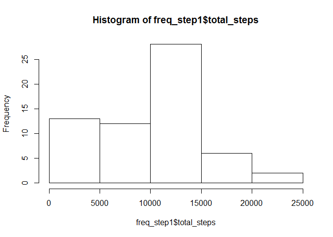

# Reproducible Research: Peer Assessment 1


## Loading and preprocessing the data

```r
setwd("C:/Users/Anthony/Git/RepData_PeerAssessment1")
df <- read.csv("activity.csv")
summary(df)
```

```
##      steps                date          interval     
##  Min.   :  0.00   2012-10-01:  288   Min.   :   0.0  
##  1st Qu.:  0.00   2012-10-02:  288   1st Qu.: 588.8  
##  Median :  0.00   2012-10-03:  288   Median :1177.5  
##  Mean   : 37.38   2012-10-04:  288   Mean   :1177.5  
##  3rd Qu.: 12.00   2012-10-05:  288   3rd Qu.:1766.2  
##  Max.   :806.00   2012-10-06:  288   Max.   :2355.0  
##  NA's   :2304     (Other)   :15840
```

## What is mean total number of steps taken per day?


```r
library(plyr)
```

```
## Warning: package 'plyr' was built under R version 3.1.3
```

```r
freq_step <- ddply(df, ~date, summarise, total_steps=sum(as.numeric(as.character(steps)),na.rm=F))
hist(freq_step$total_steps)
```

 

```r
mean1<-mean(freq_step$total_steps, na.rm=T)
median1<-median(freq_step$total_steps, na.rm=T)
```
####Mean and median number of steps taken per day:

```r
mean1
```

```
## [1] 10766.19
```

```r
median1
```

```
## [1] 10765
```

## What is the average daily activity pattern?

```r
freq_interval <- ddply(df, ~interval, summarise, mean=mean(as.numeric(as.character(steps)),na.rm=T))
plot(freq_interval$interval, freq_interval$mean, type="l")
```

 

```r
max_val_temp <- freq_interval[order(-freq_interval$mean),] #Interval 835 is the max average steps.
max_val <- max_val_temp[1,1]
```
####Interval with max value:

```r
max_val
```

```
## [1] 835
```

## Imputing missing values
####Number of missing values:

```r
missing_val <- sum(is.na(df$steps))
missing_val
```

```
## [1] 2304
```

```r
freq_step1 <- ddply(df, ~date, summarise, total_steps=sum(as.numeric(as.character(steps)),na.rm=T))
hist(freq_step1$total_steps)
```

 

####Difference from not imputed and imputed:

```r
diff_mean <- mean1-mean(freq_step1$total_steps)
diff_median <- median1-median(freq_step1$total_steps)
diff_mean
```

```
## [1] 1411.959
```

```r
diff_median
```

```
## [1] 370
```

## Are there differences in activity patterns between weekdays and weekends?

```r
df$weekday <- weekdays(as.Date(df$date))
df$week[df$weekday == "Monday" | df$weekday == "Tuesday"| df$weekday == "Wednesday"| df$weekday == "Thursday"| df$weekday == "Friday"] <- "weekday"
df$week[df$weekday == "Saturday" | df$weekday == "Sunday"] <- "weekend"
freq_week<- ddply(df, .(interval,week), summarise, mean=mean(as.numeric(as.character(steps)),na.rm=T))

library(lattice)
xyplot(as.numeric(as.character((freq_week$mean))) ~ freq_week$interval | as.factor(freq_week$week), type="l", layout=c(1,2), xlab="interval", ylab="steps")
```

 
